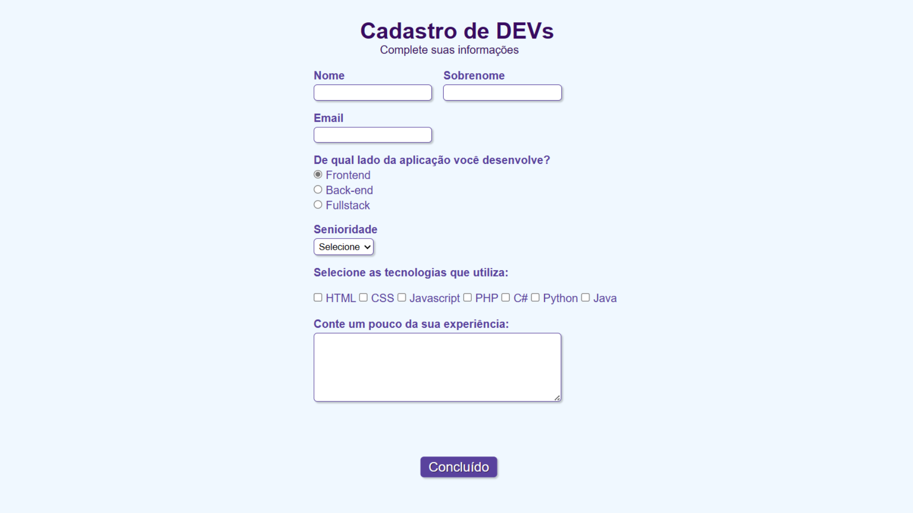

# Cadastro de DEVs

## Projeto 💻
Projeto desenvolvido por meio de um vídeo no YouTube do canal da Rafaella Ballerini.
- YouTube: [FORMULÁRIOS COM HTML e CSS!](https://youtu.be/wwqOJ2o84S4?si=Jb82sbObT5TOe_HB)

## Instalação 🛠
Siga esses passos para instalar o repositório:
1. Rode `git clone https://github.com/dudaishiyama/Cadastro-de-DEVs` para fazer um clone desse repositório.
2. Abra o arquivo HTML.

## Tecnologias 🚀
As tecnologias utilizadas nesse projeto são:
- HTML
- CSS

## Créditos ❤️
Feito por [Duda Ishiyama](https://github.com/dudaishiyama/).